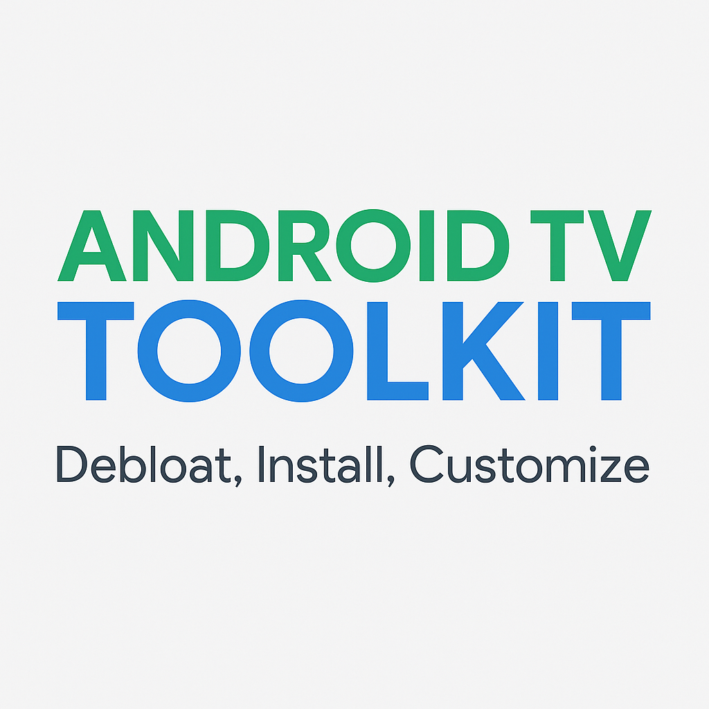

# Android TV Toolkit

Lightweight Windows application to debloat TCL/Google Android TV devices, install APKs, and customize the TV experience.

Built with ❤️ using Python and PySimpleGUI.

---

## Features
- Connect to Android TV over Wi-Fi (ADB Wireless)
- Debloat TCL and Google bloatware
- Remove Google TV Recommendations
- Install APKs remotely (FLauncher included)
- Disable Google Launcher safely (after installing a custom launcher)
- Reboot TV remotely

---

## Requirements
- Windows 10 or 11
- TV must have Developer Options enabled
- ADB Debugging turned ON
- TV and PC must be on the same Wi-Fi network

---

## Setup Instructions
1. Enable Developer Options (Settings > Device Preferences > About > Build Number > Click 7 times).
2. Turn on ADB Debugging.
3. Download and unzip this project.
4. Run `run_toolkit.exe`.
5. Enter your TV's IP address and use the provided options.

---

## Optional: FLauncher (Custom Launcher)

If you plan to disable Google TV Launcher, install a backup launcher first.

Download FLauncher APK here:
- [Download FLauncher (v1.3.3)](https://github.com/zyprex/FLauncher/releases)

Steps:
1. Install FLauncher using the "Install APK" button inside this Toolkit.
2. Open FLauncher manually from your TV Apps list.
3. (Optional) Set it as default launcher if prompted.

✅ FLauncher is a clean, open-source, ad-free Android TV launcher.

---

## Credits
Inspired by the Reddit Android TV community.  
Built for the community to simplify TV customization.

---

## License
This project is licensed under the MIT License.
