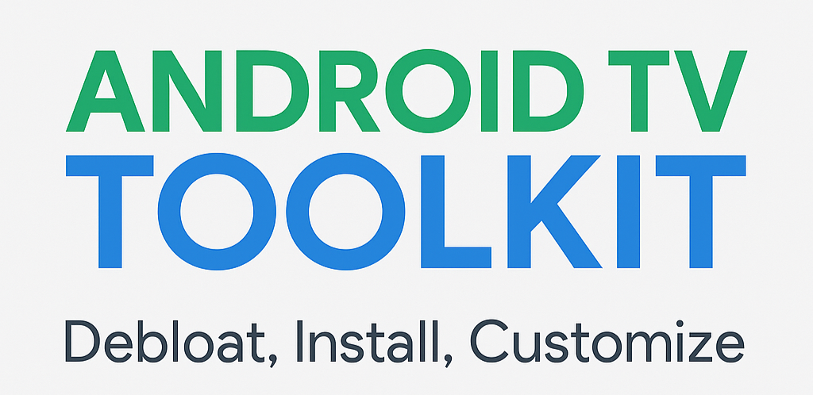

  

# Android TV Toolkit

Lightweight Windows application to debloat TCL/Google Android TV devices, install APKs, and customize the TV experience.

Built using Python and PySimpleGUI.

---

## Features
- Connect to Android TV over Wi-Fi (ADB Wireless)
- Debloat TCL and Google bloatware
- Remove Google TV Recommendations
- Install APKs remotely (FLauncher included)
- Disable Google Launcher safely (after installing a custom launcher)
- Reboot TV remotely

---

## Requirements
- Windows 10 or 11
- TV must have Developer Options enabled
- ADB Debugging turned ON
- TV and PC must be on the same Wi-Fi network

---

## Setup Instructions
1. Enable Developer Options (Settings > Device Preferences > About > Build Number > Click 7 times).
2. Turn on ADB Debugging.
3. Download and unzip this project.
4. Run `run_toolkit.exe`.
5. Enter your TV's IP address and use the provided options.

---

## Optional: FLauncher (Custom Launcher)

If you plan to disable Google TV Launcher, install a backup launcher first.

Download FLauncher APK here: See where to download below (there might be other sources online)

Steps:
1. Install FLauncher using the "Install APK" button inside this Toolkit.
2. Open FLauncher manually from your TV Apps list.
3. (Optional) Set it as default launcher if prompted.

✅ FLauncher is a clean, open-source, ad-free Android TV launcher.

---

## Credits
Inspired by the Reddit Android TV community.  
Built for the community to simplify TV customization.

---
## 📖 FAQ

---

**Q: Do I need to install Python to run the Toolkit?**  
**A:** No. The provided `run_toolkit.exe` is fully standalone. You can unzip and run without installing anything else.

---

**Q: Will this work on all Android TV devices?**  
**A:** The Toolkit is designed for Android TV devices that allow ADB Debugging. It works with TCL TVs, Onn 4K boxes, and Nvidia Shield TV (safe mode recommended first).

---

**Q: What if I don't see Developer Options on my TV?**  
**A:** Go to **Settings → Device Preferences → About → Build Number** and click it 7 times to unlock Developer Options.

---

**Q: Is there a risk of disabling important apps?**  
**A:** Always start with "**Debloat TV - Safe Mode**," which carefully removes common bloatware without affecting critical system apps.

---

**Q: Is the Toolkit free to use?**  
**A:** Yes! It’s open-source, released under the MIT License.

---

## 🚀 How to Use the Toolkit

---

**Step 1:** Enable Developer Options on your Android TV:
- Go to **Settings → Device Preferences → About → Build Number** and click it 7 times.

**Step 2:** Enable **ADB Debugging** inside Developer Options.

**Step 3:** Unzip the Toolkit and open `run_toolkit.exe`.

**Step 4:** Enter your TV's IP Address and click **Connect**.

**Step 5:** Choose a function:
- **Debloat TV (Safe Mode)** — recommended first
- **Install APKs** (such as FLauncher)
- **Remove Google TV Recommendations**
- **Disable Google Launcher** (only after installing a backup launcher!)

**Step 6:** Enjoy a faster, cleaner Android TV experience!

---

## 📥 Where to Download FLauncher

---

FLauncher is a minimalist launcher recommended before disabling the default Google TV launcher.  
You can download it safely here:

🔗 [Download FLauncher from APKPure](https://apkpure.com/flauncher/me.efesser.flauncher)

---

## 🛠️ Troubleshooting: ADB Connection Issues

If you encounter a problem connecting your TV (for example: cannot connect to [IP address]:5555,
or adb.exe not compatible with Windows error), it may be related to the version of ADB included.

To fix it:
You can manually replace the adb.exe, AdbWinApi.dll, and AdbWinUsbApi.dll files in the Toolkit's adb folder with the latest version from: https://adbdownload.com/ or directly from the official Google platform-tools if you prefer: https://developer.android.com/studio/releases/platform-tools

Steps to update ADB manually:

Download the latest ADB tools.

Copy adb.exe, AdbWinApi.dll, and AdbWinUsbApi.dll.

Replace the existing files in the adb folder inside the Toolkit directory.

After replacing, try connecting your TV again through the Toolkit.

---

## 🛠️ About the EXE

The run_toolkit.exe included in this project was built from the open-source run_toolkit.pyw script using PyInstaller.

If you prefer, you can rebuild the EXE yourself using the following steps:
python -m pip install pyinstaller
pyinstaller --onefile --windowed run_toolkit.pyw

This project is fully open-source — nothing hidden.

You can review, modify, or rebuild the Toolkit freely based on your needs.

---

## License
This project is licensed under the MIT License.
