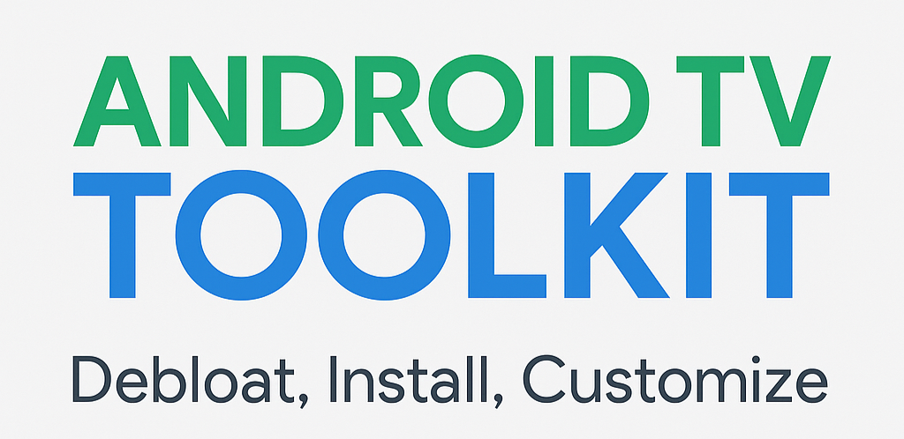

<p align="center">
  
</p>

[](https://github.com/seun-novodev/android-tv-debloat-toolkit/releases/latest)

# Android TV Toolkit

Lightweight Windows application to debloat TCL/Google Android TV devices, install APKs, and customize the TV experience.

Built using Python and PySimpleGUI.

> **Maintenance status:** This project is not actively maintained. It works as described and issues are read, but updates and responses may be slow. Pull requests are welcome — see the source code, it's short and straightforward.

---

## Features
- Connect to Android TV over Wi-Fi (ADB Wireless)
- Pair & Connect for Android 11+ / Chromecast with Google TV (Wireless Debugging)
- Debloat TCL and Google bloatware
- Remove Google TV Recommendations
- Install APKs remotely (FLauncher included)
- Disable Google Launcher safely (after installing a custom launcher)
- Reboot TV remotely

---

## ⚠️ Why Did Antivirus Flag This as a Trojan?

**Short answer: it was a false positive. There is no trojan, spyware, or malicious code in this project.**

Previous versions included a pre-built `run_toolkit.exe` file. This triggered antivirus warnings for three reasons — none of which involve actual malware:

1. **PyInstaller packaging** — The exe was built with PyInstaller, which bundles a Python runtime and unpacks itself into a temporary folder at launch. This self-extracting behaviour is identical to how some malware operates, so antivirus tools flag it heuristically even when the code inside is completely clean.
2. **Shell command execution** — The old code used `os.popen()` to run ADB commands, which passes commands through the Windows shell. Antivirus tools see a GUI program silently spawning shell processes and treat it as suspicious.
3. **Bundled ADB binaries** — Shipping `adb.exe` inside a zip alongside an unsigned executable is another common malware pattern that triggers heuristic detection.

**What changed in v1.2:**
- The pre-built `run_toolkit.exe` has been **removed from the repo entirely**. You run the toolkit directly from the Python source — no packaging, nothing to flag.
- All shell commands have been rewritten to use Python's `subprocess` module with explicit argument lists (no shell involvement), which is both safer and less suspicious to antivirus tools.
- Input validation was added so no user-supplied data is ever passed unsanitised to a system command.

You are encouraged to read the source code (`run_toolkit.py`) yourself — it is short, straightforward, and does exactly what it says.

---

## Requirements
- Windows 10 or 11
- **Python 3.8 or later** — [Download from python.org](https://www.python.org/downloads/)
- TV must have Developer Options enabled
- ADB Debugging turned ON
- TV and PC must be on the same Wi-Fi network

---

## 🚀 Setup & Usage (v1.2+)

### Step 1 — Install Python

Download and install Python 3.8+ from [python.org](https://www.python.org/downloads/).  
During installation, check **"Add Python to PATH"**.

### Step 2 — Install the required library

Open a Command Prompt and run:

```
pip install PySimpleGUI
```

> **PySimpleGUI licence note:** PySimpleGUI v5+ requires a free account at [PySimpleGUI.com](https://www.pysimplegui.com) to suppress the licence prompt. No payment is needed for personal use — just sign up and the prompt goes away.

### Step 3 — Download this project

Click the green **Code** button on this page → **Download ZIP**, then unzip it anywhere.

### Step 4 — Enable ADB on your TV

1. Go to **Settings → Device Preferences → About → Build Number** and click it 7 times to unlock Developer Options.
2. Go to **Settings → Device Preferences → Developer Options** and turn on **ADB Debugging**.

### Step 5 — Run the Toolkit

Open a Command Prompt in the project folder and run:

```
python run_toolkit.py
```

Or double-click `run_toolkit.py` if Python is associated with `.py` files on your system.

### Step 6 — Connect and use

**Standard Android TV (TCL, Onn, Nvidia Shield):**
1. Click **Connect to TV** and enter your TV's IP address (find it under **Settings → Network → About**).

**Android 11+ / Chromecast with Google TV:**
1. Enable **Wireless Debugging** in Developer Options (separate from ADB Debugging).
2. Click **Pair & Connect (Android 11+ / Chromecast)** and fill in the IP, Pairing Port, Pairing Code, and Debug Port shown on your TV's Wireless Debugging screen.

Then choose a function:
- **Safe Debloat** — recommended first run; removes common bloatware safely
- **Advanced Debloat** — more options with risk ratings (✅ Safe / ⚠️ Caution / 🚫 Critical)
- **Install APK** — install apps directly to your TV
- **Disable Google TV Launcher** — only do this after installing a backup launcher like FLauncher

---

## Optional: FLauncher (Custom Launcher)

If you plan to disable the Google TV Launcher, install a backup launcher first so you don't get locked out.

1. Download the FLauncher APK from [APKPure](https://apkpure.com/flauncher/me.efesser.flauncher).
2. Use the **Install APK** button in the Toolkit to push it to your TV.
3. Open FLauncher from your TV's Apps list to confirm it works.
4. Then use **Disable Google TV Launcher** in the Toolkit.

✅ FLauncher is open-source, ad-free, and maintained by the community.

---

## 🛠️ Troubleshooting: ADB Connection Issues

**"adb not found" error:**
The toolkit looks for ADB in the `adb/` folder next to the script. Make sure you unzipped the full project (not just the `.py` file).

**32-bit ADB / incompatible with 64-bit Windows:**
The bundled `adb.exe` may be 32-bit. Replace the files in the `adb/` folder with the latest 64-bit version:
- Download from [Google's official platform-tools](https://developer.android.com/studio/releases/platform-tools)
- Copy `adb.exe`, `AdbWinApi.dll`, and `AdbWinUsbApi.dll` into the `adb/` folder, replacing the existing files

**"Failed to connect" / "connection refused":**
- Make sure ADB Debugging is enabled on the TV
- Make sure the TV and PC are on the same Wi-Fi network
- If using a Chromecast or Android 11+ device, use the **Pair & Connect** button instead of **Connect to TV**

---

## 📖 FAQ

**Q: Do I need to install anything to run the Toolkit?**  
**A:** Yes — Python 3.8+ and the `PySimpleGUI` library (`pip install PySimpleGUI`). This replaced the old `.exe` approach to eliminate antivirus false positives.

**Q: Will this work on all Android TV devices?**  
**A:** The Toolkit is designed for devices that support ADB Debugging — TCL TVs, Onn 4K boxes, and Nvidia Shield TV. Chromecast with Google TV is supported via the Pair & Connect option. Start with Safe Debloat mode if you are unsure.

**Q: Is there a risk of disabling important apps?**  
**A:** Always start with **Safe Debloat**, which only removes known bloatware. The Advanced mode shows risk ratings for each app (✅ / ⚠️ / 🚫) so you can make informed choices.

**Q: Is the Toolkit free to use?**  
**A:** Yes — fully open-source under the MIT License.

**Q: The old `.exe` got flagged by my antivirus. Is this version safe?**  
**A:** Yes. See the [Why Did Antivirus Flag This?](#️-why-did-antivirus-flag-this-as-a-trojan) section above. Running from Python source removes every trigger that caused those false positives.

**Q: Is this project actively maintained?**  
**A:** Not actively. The toolkit works as described and issues are read, but updates may be infrequent. The source code is short and well-structured — contributions via pull request are welcome.

---

## What Changed in v1.2

| Area | Before | After |
|---|---|---|
| Distribution | Pre-built `run_toolkit.exe` (PyInstaller) | Run from Python source directly |
| Shell commands | `os.popen()` — passes through Windows shell | `subprocess.run()` with argument lists — no shell |
| Input validation | None — raw user input passed to commands | IP address validated before any ADB call |
| Error reporting | Fragile string matching on command output | Return codes checked; errors shown clearly |
| ADB target | Port hardcoded to 5555 in some places | Consistent `ip:port` target throughout |
| State management | Global variables | `TVConnection` class |
| Android 11+ / Chromecast | Not supported | New Pair & Connect flow |

---


## 🔨 Building a Windows Executable (Optional)

If you prefer a standalone `.exe` over running from Python source, you can build one yourself:

1. Install PyInstaller: `pip install pyinstaller`
2. Run from the project folder:
   ```
   pyinstaller --onefile --windowed run_toolkit.py
   ```
3. Find the output in the `dist/` folder as `run_toolkit.exe`

> **Important:** A self-built exe is trusted by your own machine but will likely trigger antivirus warnings on anyone else's — this is a known PyInstaller false positive, not malware. See the [Why Did Antivirus Flag This?](#️-why-did-antivirus-flag-this-as-a-trojan) section above. For sharing with others, always point them to the Python source.
## Credits

Inspired by the Reddit Android TV community.  
Built for the community to simplify TV customization.

---


## License
This project is licensed under the MIT License.